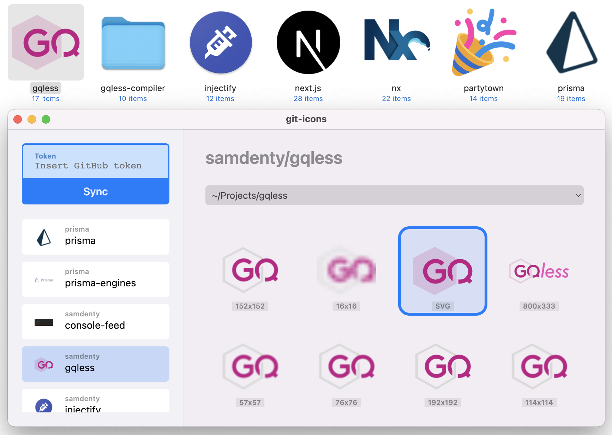

<h1 align="center">
  
</h1>

Automatically adds project logos to your locally cloned GitHub repos.

This repository contains the source code for the git-icons CLI. [The app can be found over here](https://samddenty.gumroad.com/l/git-icons) and you can also [sponsor this project](https://github.com/sponsors/samdenty)

[](https://samddenty.gumroad.com/l/git-icons)

## Building locally

```bash
brew install mysql-client
cargo install diesel_cli --no-default-features --features mysql
cargo build --release
```
