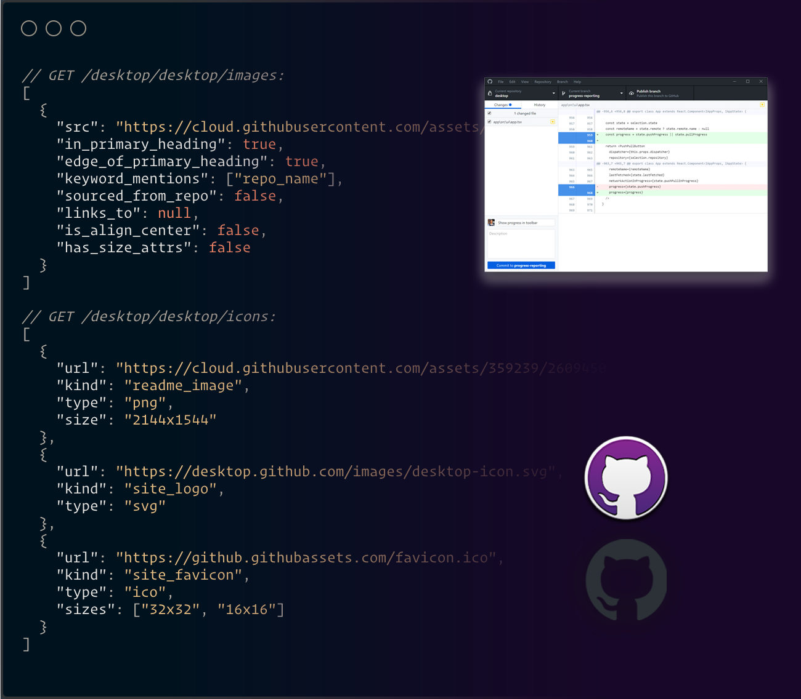

# repo_icons

[](https://crates.io/crates/repo_icons)
[](https://docs.rs/repo_icons/)


An API / Rust Library / CLI to get icons for any GitHub repo. [Test the demo API out](https://repo-icons.samdenty.workers.dev/desktop/desktop/icons)

[](https://repo-icons.samdenty.workers.dev/desktop/desktop/icons)

## Features

- Super fast!
- Partially downloads images to find the sizes
- Extracts images from the repo's homepage using [site_icons](https://github.com/samdenty/site_icons)
- Supports WASM (and cloudflare workers)

### CLI

You can test it out locally, by downloading & running the CLI:

```bash
cargo install repo_icons

repo-icons facebook/react
# data:image/svg+xml;base64,PHN2ZyB4bWxucz0iaHR0cDovL3d3dy53My5vcmcvMjAwMC9zdmciIHZpZXdCb3g9Ii0xMS41IC0xMC4yMzE3NCAyMyAyMC40NjM0OCI+CiAgPHRpdGxlPlJlYWN0IExvZ288L3RpdGxlPgogIDxjaXJjbGUgY3g9IjAiIGN5PSIwIiByPSIyLjA1IiBmaWxsPSIjNjFkYWZiIi8+CiAgPGcgc3Ryb2tlPSIjNjFkYWZiIiBzdHJva2Utd2lkdGg9IjEiIGZpbGw9Im5vbmUiPgogICAgPGVsbGlwc2Ugcng9IjExIiByeT0iNC4yIi8+CiAgICA8ZWxsaXBzZSByeD0iMTEiIHJ5PSI0LjIiIHRyYW5zZm9ybT0icm90YXRlKDYwKSIvPgogICAgPGVsbGlwc2Ugcng9IjExIiByeT0iNC4yIiB0cmFuc2Zvcm09InJvdGF0ZSgxMjApIi8+CiAgPC9nPgo8L3N2Zz4K site_logo svg
# https://reactjs.org/icons/icon-512x512.png?v=f4d46f030265b4c48a05c999b8d93791 app_icon png 512x512
# https://reactjs.org/icons/icon-384x384.png?v=f4d46f030265b4c48a05c999b8d93791 app_icon png 384x384
```

### Rust usage

```rust
use repo_icons::get_repo_icons;

let icons = get_repo_icons("facebook", "react").await?;

for icon in icons {
  println("{:?}", icon)
}
```

## Deploying to Cloudflare Workers

Clone this repo locally, and then:

```
cd api
wrangler publish
```

## Running locally

Install [cargo make](https://github.com/sagiegurari/cargo-make) and then:

```bash
# to run cli
cargo make run facebook/react

# or to run the API devserver
cd api
cargo make run
```
